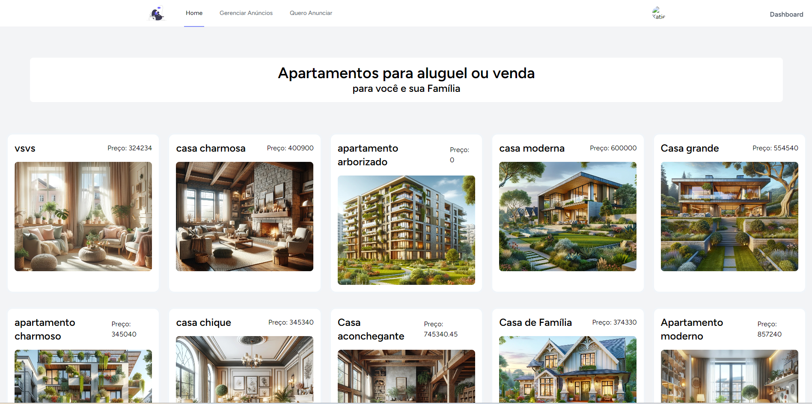

# Immobile web
This practical challenge consists of creating a property sales website, for me it was very challenging, as I learned how to do some things I hadn't done before, and that was really cool, I really liked it

## Preview


## Technical information:

- Backend:
In this project, php, Laravel and Inertia were used for Backend development
and for the database, I used MySQL.

- Frontend:
Developed a simple interface using Vue.js, Tailwind CSS
and also PrimeVue for the components.

### How to use:
  
- The PHP version used in the Project is PHP 8.2.11
- click on the green button above (<> code) and copy the link:
- configure the database with .env
- Copy the **.env.example** file to **.env** and configure the database-related environment variables
- run the commands:
```
composer install
```
```
npm install
```
- then run the command
```
php artisan key:generate
```
- open the server:
```
php artisan serve
```
- leave npm running:
```
npm run dev
```
- run the migrations:
```
php artisan migrate
```
and finally run this command:
```
php artisan storage:link
```
- access the URL: http://127.0.0.1:8000/